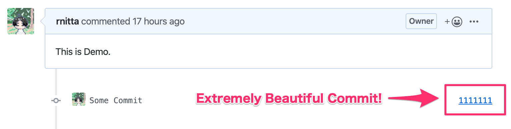
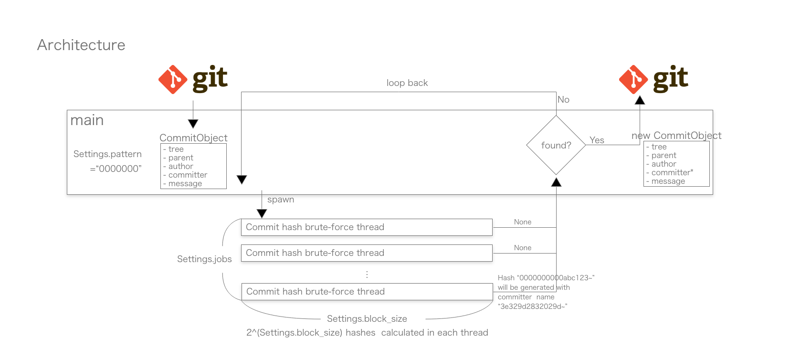

# Commit Artist

A CLI tool to beautify latest commit of your git repository.



## Usage

### Install Commit Artist

```shell
$ cargo install commit_artist

$ cd <your_working_dir>

$ git log -1 --format=%H
86637c3f206d228df1dc1dafa49d31b159b8a358

$ commit_artist -p 1234567
173015040 hashes calculated...
Yay! Now your new hash of the latest commit is 12345672abd92a159f3886e08951f29ee7ce0041.

$ git log -1 --format=%H
12345672abd92a159f3886e08951f29ee7ce0041
```

### Command Line Options

- [--path] Path to working directory. default: current directory
- [--pattern, -p] Pattern to match. default: 0000000
- [--block, -b] log\[2\](how many hashes should be calculated in each thread). default: 20
- [--jobs, -j] the number of threads that will be spawned to bruteforce. default: your max - 1

## How it works


A commit hash of git is generated from commit object.  
Commit object consists of

- Tree hash
- Parent hash
- Author
    - Name
    - Email address
    - Timestamp  
- Committer
    - Name
    - Email address
    - Timestamp  
- Commit message  

One of the easiest thing to configure (even after the commit is done) among these attributes above is committer's name.  
Changing it may affect almost nothing but commit hash.  

So, after a commit is done, by running Commit Artist, through changing committer's name and calculating commit hash and loop back unless it is beautiful, finally you can get a commit which have sophisticated hash. 

## Disclaimer
Use this tool on your own responsibility.  
This tool is absolutely helpless with [signed commit](https://git-scm.com/book/en/v2/Git-Tools-Signing-Your-Work).   